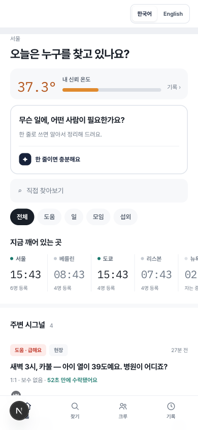
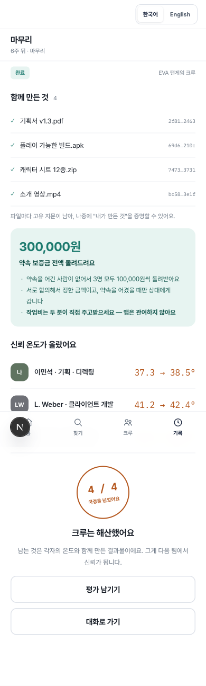
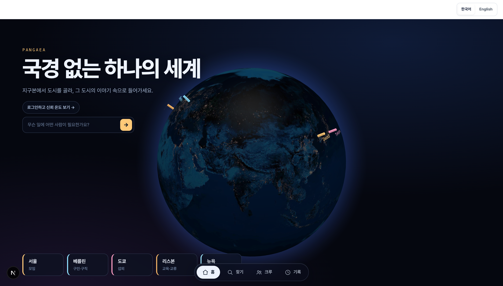
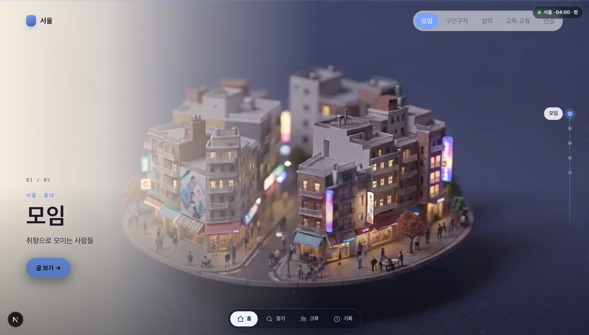
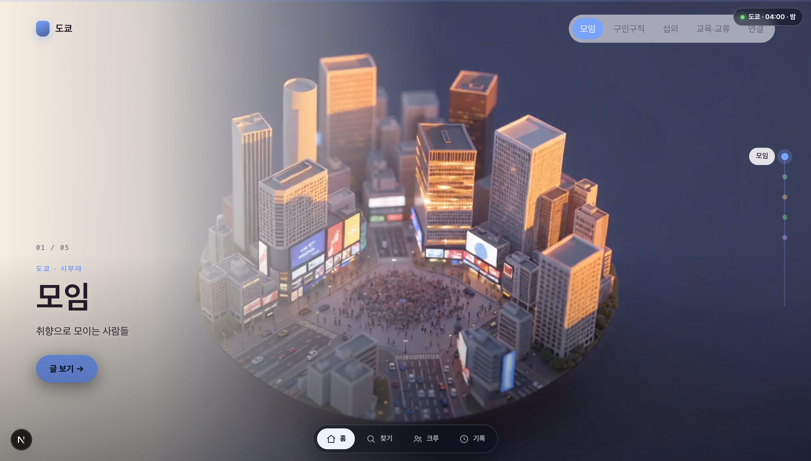
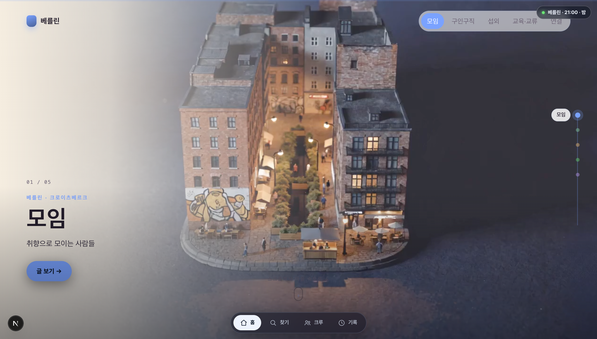
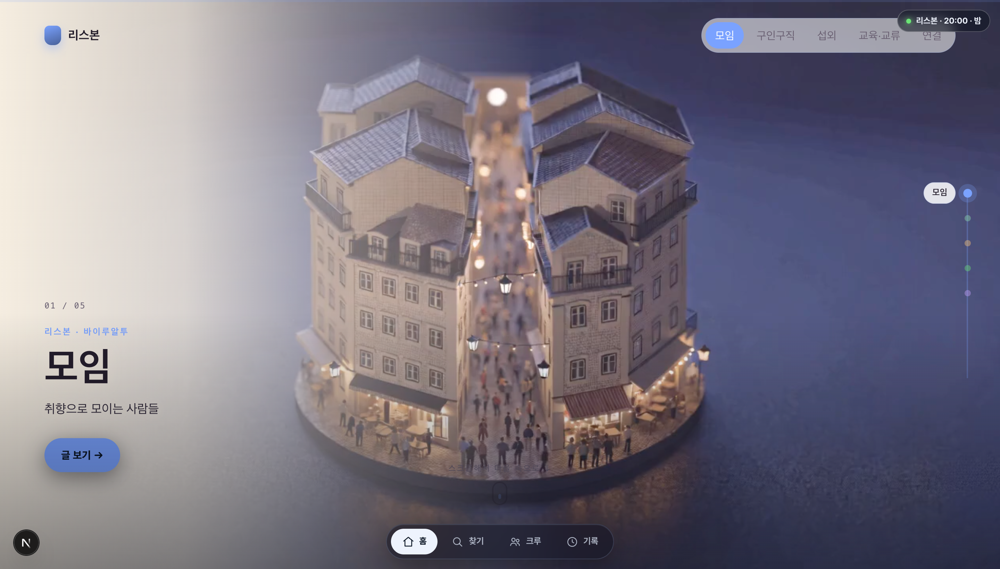

# PANGAEA

인증된 사람을 미리 등록해 두고, 필요한 사람이 생기면 **국경과 상관없이** 그중에서 매칭·추천받는 서비스.
네 개의 국경(지리·언어·문화·조직)을 넘는 데모 수직 슬라이스가 전부 동작합니다.

|                                             |                                              |
| ------------------------------------------- | -------------------------------------------- |
|        |  |
| 홈 — 신뢰 온도 · 깨어 있는 곳 · 시그널 피드 | 마무리 — 보증금 전액 환급 · 37.3→38.5°       |

## 🌍 지구본 홈 & 스크롤 월드

로그인하면 **판게아 지구본**이 홈입니다. 도시를 고르면 그 도시의 다섯 마을 속으로 들어가고,
**스크롤이 카메라를 움직여** 마을 속으로 다이브했다가 지도 위를 날아 다음 마을로 이어집니다.



| 서울 · 홍대                             | 도쿄 · 시부야                           | 베를린 · 크로이츠베르크                    |
| --------------------------------------- | --------------------------------------- | ------------------------------------------ |
|  |  |  |

| 리스본 · 바이루알투                        | 뉴욕 · 윌리엄스버그                       |
| ------------------------------------------ | ----------------------------------------- |
|  |  |

- **5개국 × 5개 마을** — 모임·구인구직·섭외·교육교류·연결을 각 도시의 실제 동네에 매핑
  (서울: 홍대·강남·을지로·잠실·광화문 …).
- **스크롤 = 카메라.** 시네마틱 다이브 + 지도 위 비행(이음새 프레임을 고정한 커넥터로 컷 없이 연결),
  틸트시프트 미니어처 톤.
- **현지 시간 낮/밤** — 지구본 텍스처와 화면 톤이 도시의 실제 시간에 따라 어두움↔밝음으로 전환.
- 마을별 **「글 보기」** → 그 동네의 글이 `/home` 카드와 동일한 형식으로 열립니다.

## 원칙 (코드로 강제)

- **AI는 표현만 한다.** 역할·순위·점수·신뢰 온도·보증금 금액·과실을 판정하지 않는다.
  - 역할은 요청자 폼에서만 온다 (`signal_roles.source = 'USER_FORM'` CHECK).
  - 추천 순서는 `matching.v1` 사전식 정렬 — 문화·국적·신뢰 온도는 입력이 아니다.
  - 신뢰 온도는 `trust.v1` 결정적 공식 (완료 +1.2 → 데모의 37.3→38.5 재현).
- **근거 없으면 침묵한다.** 문화 주석은 실재하는 KB 레코드 + 확신도 게이트를 통과할 때만 표시된다.
- **번역은 숨기지 않는다.** 숫자 다중집합 검사에 실패하면 원문 그대로 발신하고 「번역 확인 필요」 칩을 단다.
- **경고는 차단이 아니다.** 발신 전 가드가 HIGH여도 「그대로 보내기」는 살아 있고, 무시 이력은 신뢰 지표에 반영되지 않는다.
- **앱은 작업 대금에 관여하지 않는다.** 약속 보증금(sandbox)만 다루며 원장은 append-only다.
- **키 없이 다 돌아간다.** `AI_MODE=stub`(기본)에서 전체 테스트·전 화면이 동작한다.

## 스택

Next.js 15(App Router) · next-intl(ko/en) · FastAPI · Python 3.12 · SQLAlchemy 2 · PostgreSQL 16 + pgvector · Redis · `pangaea_ai`(결정적 스텁 + OpenAI 번역 어댑터)

## 로컬 실행 (macOS, Docker 불필요)

```bash
# 0) 의존 서비스 (Homebrew)
brew install postgresql@16 redis && brew services start postgresql@16 redis
# pgvector가 필요합니다. brew 포뮬러가 pg16과 안 맞으면 소스 빌드:
#   git clone https://github.com/pgvector/pgvector && cd pgvector
#   make install PG_CONFIG=/opt/homebrew/opt/postgresql@16/bin/pg_config

# 1) DB (마이그레이션이 citext·vector 확장을 만들므로 superuser 롤 권장)
/opt/homebrew/opt/postgresql@16/bin/psql -d postgres \
  -c "CREATE ROLE pangaea LOGIN SUPERUSER PASSWORD 'pangaea-local-only'" \
  -c "CREATE DATABASE pangaea OWNER pangaea"

# 2) 환경 변수 — 호스트명을 localhost로
sed -e 's|@postgres:|@localhost:|' -e 's|redis://redis:|redis://localhost:|' \
    -e 's|http://minio:|http://localhost:|' .env.example > .env
cp .env backend/.env

# 3) 백엔드
cd backend
uv venv --python 3.12 && uv pip install -e ".[dev]"
.venv/bin/alembic upgrade head
.venv/bin/python -m scripts.seed_demo        # 멱등 — 여러 번 실행해도 안전
.venv/bin/python -m app.server               # http://localhost:8000
cd ..

# 4) 프런트엔드
pnpm install --frozen-lockfile
pnpm --filter frontend dev                   # http://localhost:3000
```

> Docker가 있는 환경이라면 기존처럼 `docker compose up -d` 후 같은 순서로 진행하면 됩니다.
> pre-commit/pre-push 훅은 Docker가 없으면 자동으로 `backend/.venv`를 사용합니다.

### 휴대폰에서 열기 (모바일이 이 앱의 정본입니다)

두 서버 모두 `0.0.0.0`에 바인딩되므로, 같은 Wi-Fi의 휴대폰에서 바로 열립니다.

```bash
ipconfig getifaddr en0        # 맥의 LAN IP 확인 (예: 192.168.0.155)
```

휴대폰 브라우저에서 `http://<맥-IP>:3000` 접속 — API 주소는 접속한 호스트를 자동으로 따라가고,
개발 모드 CORS가 사설망 오리진을 허용하므로 별도 설정이 없습니다.

- **iPhone (Safari)**: 공유 → **홈 화면에 추가** → 전체 화면 앱으로 실행됩니다.
- **Android (Chrome)**: 메뉴 → **앱 설치** (PWA 매니페스트·아이콘 포함).
- 접속이 안 되면 macOS 방화벽에서 Python(백엔드)과 Node(프런트) 수신을 허용하세요.

### 데모 계정

시드가 만든 모든 계정의 비밀번호는 `pangaea-demo1!` 입니다.

| 계정                                     | 역할                                             |
| ---------------------------------------- | ------------------------------------------------ |
| `minseok@pangaea.dev`                    | 이민석 — EVA 팬게임 크루 요청자 (기본 시연 계정) |
| `weber@pangaea.dev` / `sato@pangaea.dev` | 크루 멤버 (완료 확인·다국어 메시지 시연)         |
| `jkim@pangaea.dev` 외                    | 직접 찾기·지원함 시연용                          |

### 90초 데모 동선

1. **홈** — 신뢰 온도 37.3°, 카불 HELP의 「52초 만에 수락됐어요」, 깨어 있는 도시 스트립.
2. **시그널 올리기** — 한 줄 입력 → 「이렇게 이해했어요」 + 점선 추정 태그(눌러서 수정) + 역할 직접 입력 → 발행.
3. **추천** — 「순서는 어떻게 정해지나요?」 펼치기: 서버가 내려준 사전식 기준 + "문화나 국적은 계산에 안 들어가요".
4. **크루 대화** — 독일어 직설→문화 도우미, 일본어 보류→의도 주석, `Sato씨` 입력→보내기 전 확인(「바꿔서 보내기」= Satoさん 결정적 치환), 줄임말→번역 확인 필요 칩. 「왜 이렇게 알려주나요?」로 KB 근거 시트, 「우리는 안 그래요」로 확신도가 실제로 내려간다.
5. **마무리** — 3인 완료 확인 → 보증금 300,000원 전액 환급 → 37.3→38.5° / 41.2→42.4° → 4/4 국경 스탬프 → 상호 평가(+0.3).

### 번역 프로바이더

기본은 결정적 스텁(데모 문장 fixture, 그 외에는 원문 발신 + 확인 칩)입니다.
실번역을 켜려면 서버 `.env`에만 다음을 추가하세요 — 키는 절대 프런트에 넣지 않습니다.

```bash
TRANSLATE_PROVIDER=openai
OPENAI_API_KEY=sk-...
PANGAEA_MODEL_LOW=gpt-4o-mini   # 원하는 모델로 교체 가능
```

숫자 다중집합·길이 팽창 검사는 프로바이더와 무관하게 항상 실행되고, 실패하면 원문 폴백입니다.

## 테스트

```bash
cd backend && .venv/bin/python -m pytest -q -m "not live"   # 96 tests
cd frontend && pnpm test:e2e                                 # 11 tests (백엔드 + 시드 필요)
pnpm run verify:pre-push                                     # 전체 게이트
```

## 문서

- [통합 개발 명세서](docs/SPEC.md) — 원 설계 정본
- [진행 기록](docs/PROGRESS.md) · [결정 기록](docs/DECISIONS.md)
- 스크린샷: `docs/assets/`
